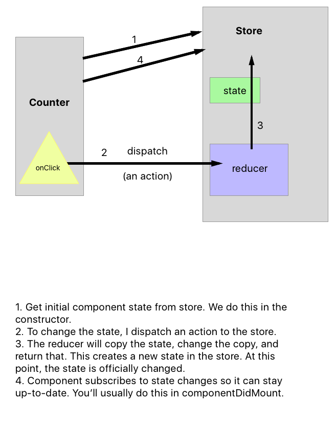

# New Project Steps

* Creating a new repository up on Github.
* We used `create-react-app` to create a new React project. We created this in our dev folder, **not** inside of another repo like `little-web-assignments`.
* We then `cd`'d into that folder, did a `git add .` and  a `git commit -m "some message"`.
* When then got the lines from the Github repo that looked like this to hook up our local project to Github.

```
git remote add origin https://github.com/tiy-dallas-march-2017-fee/end-of-week-9-review.git
git push -u origin master
```

## So, You Want To Use Redux?

* `npm install redux --save`
* Create a file for the store/redux stuff.

## A Picture!


